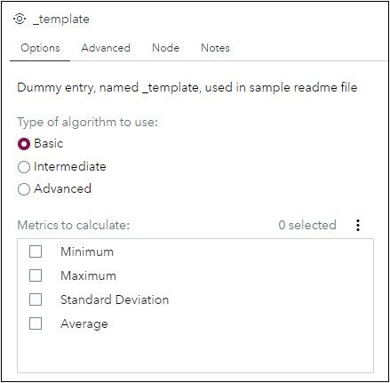

# _template

[[_TOC_]]

## Description

>Explain here what capabilities are provided by your Custom Step

The Custom Step "**MyCustomStep02**" enables SAS Studio Flow users to ...

## User Interface

>Create a screenshot for each of the tabs shown in your Custom Step UI and put them in the **img** folder and show them below.

* Options tab

   

* Advanced tab

   |

## Requirements
2020.1.5 or later
> Does your Custom Step use specific UI controls that have only been released recently, and therefore require a more recent Viya version?

> Does you Custom Step require specific products to be installed, or has other dependencies the user should know about, then mention them here. 

## Usage

> Optional: Create an animated gif that quickly demos your custom step using a dedicated flow and store it in the **img** folder

## Change Log

* Version 1 (05APR2022)
    * Initial version
